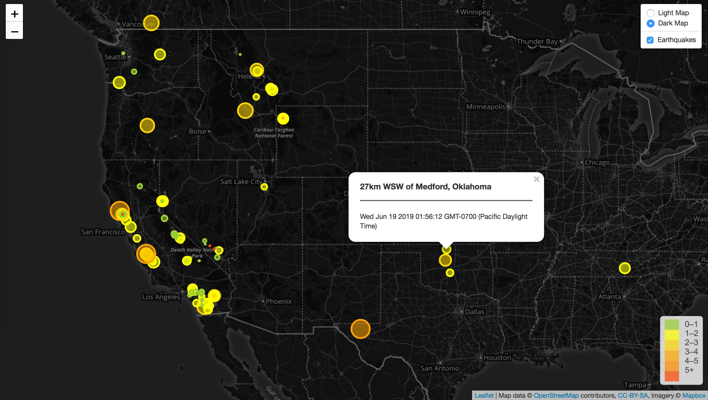

<h1>Visualizing-Data-with-Leaflet</h1> 

<h3>Import & Visualize the Data</h3>

Intaractive map was built using Leaflet that plots all of the earthquakes from data set based on their longitude and latitude.
<a href="https://earthquake.usgs.gov/earthquakes/feed/v1.0/geojson.php">USCS GeoJSON Data</a> 
 
Data markers reflect the magnitude of the earthquake in their size and color. Earthquakes with higher magnitudes are appearing larger and darker in color. Popups provide additional information about the earthquake when a marker is clicked.
Legend provide context for map data.
 
